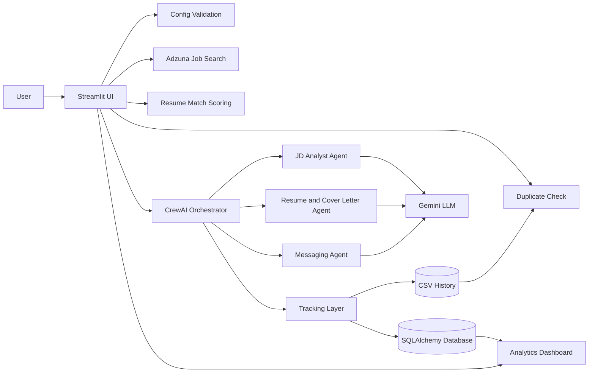

# Job Hunt Assistant - Detailed Project Report

## 1. Project Summary

Job Hunt Assistant is a multi-agent AI system that helps a job seeker discover jobs, analyze postings, and generate customized application materials. The main goal of the project is to show how an AI-driven workflow can be used to automate a realistic part of the job application process while remaining easy to run locally.

The system combines:

- Streamlit for the user interface
- CrewAI for orchestration
- Gemini for LLM generation
- Adzuna for live job search
- SQLAlchemy for persistence
- CSV files for lightweight tracking
- Plotly and Streamlit pages for analytics

The project has been developed in phases:

- MVP layer: working UI, job search, and multi-agent generation
- Tier 1 layer: logging, validation, tests, CI, and packaging
- Tier 2 layer: database, analytics, matching, deduplication, and multi-LLM foundation

## 2. Problem Statement

Applying for jobs is repetitive and time-consuming. A candidate usually has to:

- search for relevant roles
- read long descriptions
- tailor a resume summary
- write a cover letter
- draft outreach messages
- avoid applying to the same role twice
- keep track of everything they have submitted

This project automates much of that workflow.

## 3. Core Idea

The app accepts a job keyword, location, resume text, and short bio. It then:

1. fetches matching jobs
2. analyzes the job description
3. generates a tailored resume summary
4. generates a cover letter
5. generates a recruiter outreach message
6. stores the result
7. exposes analytics from the stored history

## 4. Architecture Diagram



## 5. Module-by-Module Explanation

### 5.1 `streamlit_app.py`

This is the main user-facing app.

Responsibilities:

- initialize Streamlit state
- validate configuration on startup
- collect the job role, location, resume, and bio
- fetch live job results
- display checkboxes for selection
- compute match scores
- skip duplicates
- call the orchestration pipeline
- display generated outputs

Key behavior:

- if a job has already been applied to, the app skips it
- if the resume text is present, a match score is displayed
- selected job applications are processed one by one

### 5.2 `orchestrator.py`

This file runs the main application workflow.

Steps:

1. Convert the selected job into a compact summary.
2. Extract agency and title metadata.
3. Create the three CrewAI agents.
4. Build the corresponding tasks.
5. Run the Crew sequentially.
6. Extract the generated resume summary and cover letter.
7. Save the output to CSV and the database.
8. Save the cover letter as a text file.
9. Log LLM usage metadata.

Important detail:

- if the CrewAI generation fails, the code returns a short error string rather than crashing the UI

### 5.3 `agents/`

The system has three specialized agents.

#### `jd_analyst.py`

- summarizes the job description
- extracts responsibilities, skills, qualifications, and notes

#### `resume_cl_agent.py`

- tailors the resume summary to the job
- writes a cover letter
- uses exact output markers so the result can be parsed

#### `messaging_agent.py`

- writes a short outreach message
- produces a professional, recruiter-facing tone

### 5.4 `utils/india_jobs_api.py`

This is the Adzuna integration layer.

What it does:

- builds the Adzuna query
- retries failed requests
- normalizes the returned job data into a common shape
- returns a simplified job object that the UI and orchestrator can use

### 5.5 `utils/tracking.py`

This layer handles persistence and artifacts.

It does four things:

- writes application history to `data/applications_log.csv`
- writes cover letters into `data/cover_letters/`
- stores application rows in the database
- stores LLM usage rows in the database

It also includes a CSV reader with fallback encodings so older logs do not crash the app.

### 5.6 `utils/config_validator.py`

This module ensures required API keys exist before the app starts.

Required values:

- `GEMINI_API_KEY`
- `ADZUNA_APP_ID`
- `ADZUNA_APP_KEY`

`DATABASE_URL` is optional. If PostgreSQL is not available, the app can still run.

### 5.7 `models/database.py`

This file defines the SQLAlchemy data layer.

Tables:

- `applications`
- `llm_usage`

Application table fields:

- job title
- company
- job description
- resume summary
- cover letter
- outreach message
- application status
- match score
- job hash
- timestamps

LLM usage table fields:

- agent type
- provider
- model name
- token counts
- execution time
- timestamp

Database behavior:

- PostgreSQL is attempted first if configured
- if it is unavailable, the app falls back to local SQLite

### 5.8 `services/matching.py`

This module computes a similarity score between the resume text and the job description.

The score is used for:

- visual feedback in the UI
- storing a match score on the application record
- future analytics

The implementation is lightweight and pure Python so it does not depend on fragile numerical packages during local development.

### 5.9 `services/deduplication.py`

This module prevents duplicate applications.

It creates a stable job hash from:

- job title
- company name

If the same combination appears again, the UI can skip it.

### 5.10 `services/analytics.py`

This module computes dashboard metrics from the database.

Current metrics:

- total applications
- responses
- response rate
- average match score
- top companies
- LLM execution count
- average LLM execution time

### 5.11 `pages/analytics_dashboard.py`

This is the Streamlit analytics page.

It shows:

- summary KPI cards
- application trend over time
- top companies by application count

This gives the project a more production-like feel because it exposes data after the app has been used.

## 6. End-to-End Workflow

The end-to-end flow is:

1. The user opens Streamlit.
2. Config validation runs.
3. The user enters a keyword, location, resume, and bio.
4. Adzuna returns job listings.
5. The UI shows results and computes match scores.
6. The user selects jobs to apply to.
7. Deduplication checks whether the job was already processed.
8. The orchestrator runs the three agents sequentially.
9. The generated content is stored in CSV and the database.
10. The analytics dashboard can later summarize the stored history.

## 7. Data Flow

### Input Data

- job keyword
- location
- resume text
- personal bio
- live job posting data

### Output Data

- tailored resume summary
- cover letter
- outreach message
- application log entry
- saved cover letter text file
- analytics metrics

## 8. Runtime Behavior

### Startup

At startup, the app:

- loads environment variables
- validates required keys
- creates the session state

### Search Phase

When the user searches:

- jobs are fetched from Adzuna
- the first few results are stored in session state

### Apply Phase

When the user applies:

- the app checks for duplicates
- the selected job is passed to the CrewAI pipeline
- the outputs are saved

### Analytics Phase

As the database fills up:

- the analytics dashboard shows trends and counts
- the app becomes more useful as a personal job tracking tool

## 9. Deployment and Local Setup

The project supports three practical ways to run it:

1. Local Streamlit with SQLite fallback
2. Local Streamlit with PostgreSQL
3. Docker Compose with app plus PostgreSQL

For most local development, SQLite fallback is the simplest route.

## 10. Testing and Quality Controls

The project now includes tests for:

- API parsing
- agent creation
- matching
- deduplication
- analytics
- config validation

There is also a GitHub Actions workflow that runs the test suite automatically.

## 11. Strengths of the Project

- Clear multi-agent architecture
- Real job search integration
- Practical output generation
- Persistent tracking
- Analytics support
- Good local-development ergonomics
- Test coverage and CI foundation

## 12. Current Limitations

The project is strong, but a few things remain natural next steps:

- richer analytics charts
- more job-source providers
- improved resume parsing
- cost tracking for LLM usage
- stronger semantic matching
- authentication for multiple users

## 13. How to Run

```powershell
cd "C:\Users\HP\OneDrive\Desktop\Multi-Agent Job Search System\job_hunt_assistant"
..\env\Scripts\Activate.ps1
streamlit run streamlit_app.py
```

If you want to initialize the database:

```powershell
cd "C:\Users\HP\OneDrive\Desktop\Multi-Agent Job Search System"
..\env\Scripts\Activate.ps1
python scripts\init_db.py
```

## 14. Final Assessment

This project is a good example of a modern AI workflow application because it combines:

- LLM orchestration
- job search automation
- text generation
- persistence
- analytics
- testing
- deployment support

It is not just a demo. It is a structured job search assistant with a realistic workflow and a roadmap for further enhancement.
